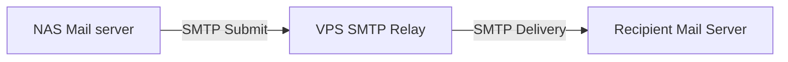

+++
title = "✉️ A secured mail server on my NAS"
description = "Setting up a secured mail server on my NAS using Tailscale funnels and Mailgun API"
extra.toc = true

[taxonomies]
tags = ["server", "communication"]
+++

## Introduction

As I just happen to have optical fiber connected to my building, the idea of buying myself a NAS server started to grow in my mind, it would help me reduce costs on the following subscriptions:

- iCloud 2To, replaced with a local photo server `immich`: -9.99€/month
- Netflix, replaced with a Plex server: -14.99€/month
- Mail server, implemented locally: -13.70€/month

> Today we will focus on the mail server set-up, which would save me almost ~165€/year.

Because I had many other projects in mind than just a mail server, I made the choice, Jan. 2024, to rent a VPS server for 13.70€/month

But thanks to my newly acquired NAS server, the need for a VPS server faded away....

## Research

To explain to those not familiar with the behavior of the mail system, in simplified form:
1. You send an email to alice@example.com.
2. Your mail server extracts the domain: example.com.
3. It performs a DNS lookup for the domain's MX (Mail Exchange) records.
4. DNS replies with the mail servers responsible for that domain (e.g., mail1.example.com).
5. Your SMTP server opens a connection to that destination mail server.
6. The receiving server accepts, rejects, or forwards the message.
7. The email is stored in Alice's mailbox.
8. Alice's email client later retrieves it via IMAP or POP3.

There is 2 points to remember:
- How to receive mails, how any sender can reach our server
- How to send mails, how can we reach other servers when sending mails.

Also, there is something to keep in mind: A NAS server should never be accessible from the public with only an IP address.

But if you read carefully, to receive or send mails, our NAS needs to be publicly accessible.

Before going further in our implementation we need to find an alternative that lets us hide our NAS from the public.

## First workflow

I thought about the following workflow:

- NAS `sender`

- NAS `recipient`

> Great idea, but I need to pay for a VPS relay, if possible I want to find free solutions as I don't need to send thousands of mails every day.

## Mailgun

I could find exactly what I was looking for, something that is:

- free (for my usage)
- trusted by other mail providers (avoiding my mails being marked as spam)
- easy to maintain
